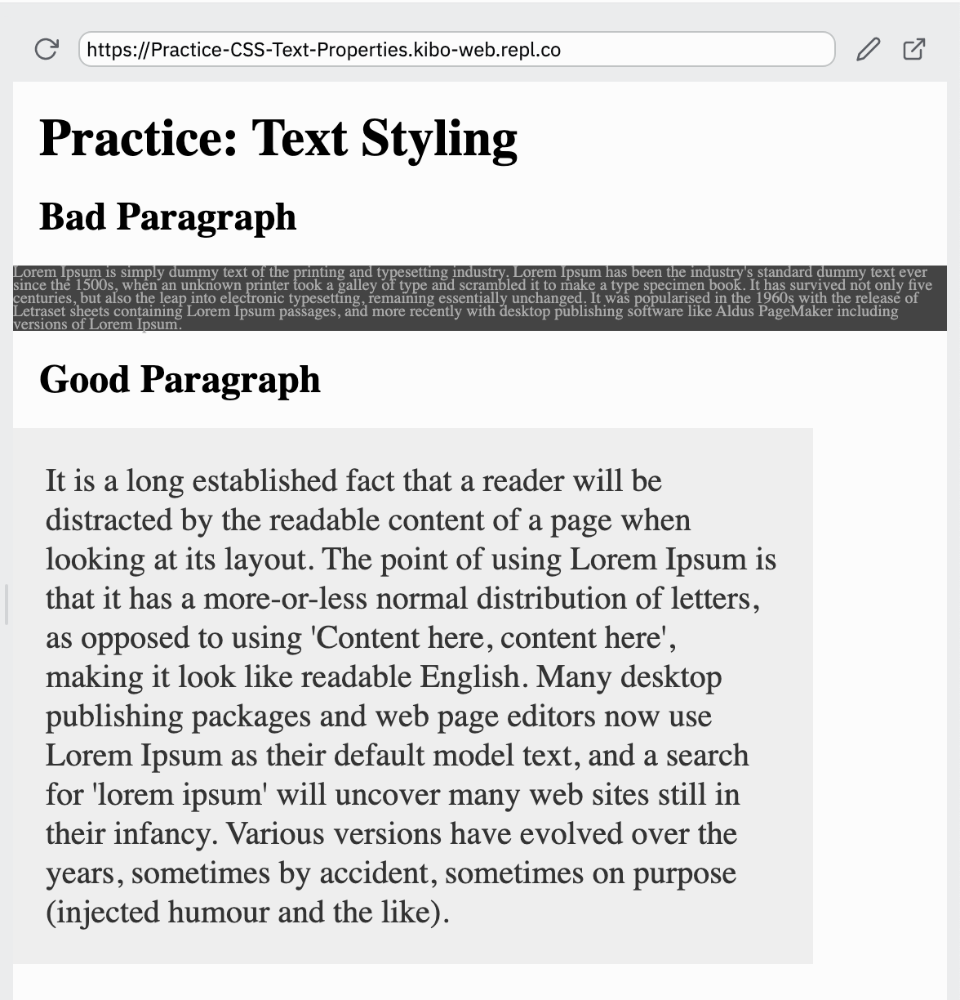

# Practice: CSS Text Properties

The key rules of typography are:

- Point size should be 15-25 pixels on the web.
- Line spacing should be 120–145% of the point size.
- The average line length should be 45–90 characters (including spaces).
- Less color is more effective. Consider making your text dark gray rather than black.

You're going to style some text that looks good, and text that looks bad, as practice.

## Instructions

There are two paragraphs of text: a good paragraph, and a bad paragraph. One, you will style so that it is readable, clear, and effective. The other, you will make unreadable, unclear, and ineffective.

Use the `font-size`, `line-height`, `max-width`, and `color` properties to style the text, according to the steps below

## Bad paragraph

* make the font size `10px`, so that the text is too small to read
* make the line height `.8`, so that the lines are too close together
* make sure the containing element (the paragraph with `.bad`) takes up the full width of the page by setting max-width to `100%`. That way, the reader's eyes have to go all the way back to the beginning to read the start of the line.
* Set the background color to `#444` and the color to `#aaa` so there isn't enough contrast to read the text.

## Good paragraph

* make the font size `20px`, so that the text is large enough to read
* make the line height `1.3`, so that the lines have nice space between them
* make sure the containing element (the paragraph with `.good`) has a max-width of `450px`, so that the reader's eyes only have to go part way across the screen.
* Add `padding: 20px` so that the paragraph has some room before and after.
* Set the background color to `#eee` and the color to `#333` so there is plenty of contrast, but it isn't quite as harsh on the eyes.

## Example

After you've completed the challenge, the page should look like this:

